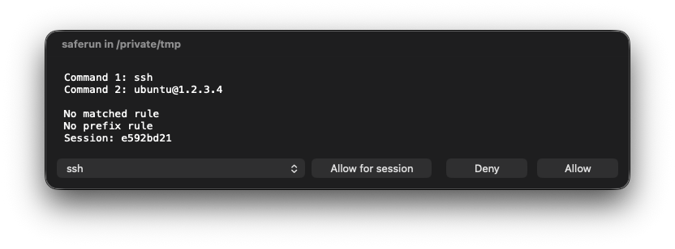

# saferun

## Introduction

`saferun` limits what commands AI agents can execute. It supports powerful matching rules and interactive prompts on MacOS.

Your AI agent executes all commands by passing them as arguments to `saferun`, which loads `allow`, `ask`, `deny`, and `prefixes` rules, then replaces itself with an authorized command. The separate `saferun-approval` process owns the macOS approval UI and memory-only session grants.

The UI allows you to interactively approve commands which are not specifically allowed or denied, including blanket approval for the session.



## Setting Up Policy

By default, `saferun` reads `~/config/saferun.yaml`. Install this repository's policy with:

```bash
mkdir -p ~/config
cp ./saferun.yaml ~/config/saferun.yaml
```

The YAML config has five rule lists:

```yaml
prefixes:
  - "env *"
  - "sudo"

shell_prefixes:
  - "bash -c"
  - "/bin/bash -c"
  - "/bin/zsh -lc"

allow:
  - "git status"
  - "git diff **"
  - "sed -n *,*p"

ask:
  - "git push **"
  - "cp"

deny:
  - "git reset **"
  - "kubectl delete **"
```

`allow` must contain at least one entry. The other lists are optional:

- `prefixes` recognizes leading wrappers such as `env` or `sudo` and strips them before `ask` and `allow` matching. Deny still checks both the full command and each stripped remainder.
- `shell_prefixes` recognizes explicit shell invocations whose payload should be inspected. Only configured variants are parsed; ordinary `prefixes` remain argv-only, but they can wrap a configured shell prefix.
- `allow` executes matching commands without prompting.
- `ask` requires interactive approval before execution.
- `deny` blocks matching commands without prompting.

Precedence is `deny`, `ask`, `allow`, then an implicit `ask` for unmatched commands.

Rules are shell-split with `shlex` and matched case-insensitively against argv:

- `*` matches characters within one argv item.
- `**` matches zero or more argv items.
- `ask` and `allow` rules permit trailing argv items.

The `sed` rule above matches both `sed -n 1,20p` and `sed -n /start/,/end/p`; each `*` stays within one argv item. Quote rules containing `*` so YAML does not treat them as aliases.

When a configured `shell_prefixes` rule leaves exactly one payload argument, `saferun` parses that payload and authorizes each top-level literal command joined by `|`, `&&`, or `;` in source order. It still executes the original shell argv unchanged, and only after every part is authorized. Quoted or escaped separators stay part of the surrounding argument.

Unsupported shell syntax is not auto-allowed. Redirections, substitutions, variables, globs, `||`, backgrounding, newlines, assignments, control flow, grouping, functions, heredocs, malformed syntax, and shell invocations with extra argv are treated as opaque implicit asks. Opaque requests are sent to the approval UI as one quoted string, so a session grant applies to that exact fragment rather than to `bash` or `zsh` broadly.

Before any approval prompt, `saferun` checks the original invocation and all statically extracted commands, including commands inside opaque constructs, against `deny`. Any configured shell prefix found inside a parsed shell payload is denied without prompting.

## Starting the Approver

Start the broker in a logged-in macOS desktop session:

```bash
./start-approver.sh
```

With an installed binary:

```bash
saferun-approval
```

The broker listens only on `/tmp/saferun-<effective-uid>/approval.sock`. Live `ask` decisions fail closed if the broker is absent or invalid. Direct allow/deny decisions and `--dry-run` do not need it. Other Unix systems build both binaries, but live approval is macOS-only.

## Approval Scopes

`Allow` approves one execution. `Allow for session` applies the dropdown's selected scope. The dropdown contains:

- every prefix of the effective command, starting with its executable
- `Matched ask rule` for a configured `ask` match
- `Allow all commands in this session`

The effective command is argv after stripping a recognized configured prefix. Approving the executable for `env X=1 python3 -c first` also approves `python3 -c second` and `env Y=2 python3 -c third`, but not `ruby -e …`.

For parsed shell payloads, each component is approved independently. For `/bin/zsh -lc 'cargo test; git push origin main'`, a policy can allow `cargo test` while prompting for `git push origin main`; the shell command itself runs only if both parts are authorized.

Session grants follow the agent token across working directories and equivalent config files. They are keyed by agent token, policy digest, and selected scope. `Allow all commands in this session` approves future approval prompts for the same agent token and current policy digest. A broker restart, key change, policy change, or cache eviction requires approval again.

## AI Agent Setup

Create one token file per agent session and retain its path:

```bash
token_file="$(saferun session-token)"
saferun -t "$token_file" -- git status
```

`saferun session-token` creates a `0600` file in the UID-owned `0700` runtime directory and prints only its non-secret path. It does not load policy or require an existing token. `saferun` validates and reads the file passed as `-t TOKEN_FILE`. The path is non-secret and visible in saferun's argv while it runs, but `-t` and its value are consumed by `saferun` and are not forwarded to the authorized child's argv or environment. Never put token contents in environment values, argv, or stdin.

Add this policy to `~/.codex/AGENTS.md` or `~/.claude/CLAUDE.md`:

````markdown
# Shell Command Policy

Run every shell command through `saferun` so it is checked against `~/config/saferun.yaml`.

```bash
token_file="$(saferun session-token)"
saferun -t "$token_file" -- git status
saferun -t "$token_file" -- cargo test
saferun -t "$token_file" -- kubectl -n monitoring get pods
```

When printing commands for the user, omit the `saferun` wrapper. Commands run by the agent must retain it.
````

Restrict the agent's native shell permissions to `saferun`.

For Codex, `~/.codex/rules/default.rules` should contain only:

```text
prefix_rule(pattern=["saferun"], decision="allow")
```

For Claude, `~/.claude/settings.json` should contain only:

```json
{
  "permissions": {
    "allow": ["Bash(saferun *)"]
  }
}
```

This is a cooperative boundary between sibling agents under one Unix account. Distinct tokens isolate conforming agents, but arbitrary same-UID code can inspect peer processes or broker traffic. An agent allowed to replace `--config` can also replace policy. A stronger threat model requires a code-identity-authenticated service.

## Usage

```bash
saferun [-h] [--config CONFIG] [-t TOKEN_FILE] [--dry-run] [--explain] -- <command> [args...]
```

Examples:

```bash
saferun -t "$token_file" -- git status
saferun -t "$token_file" -- cargo test
saferun -t "$token_file" -- kubectl -n monitoring get pods
```

Select another policy with `--config` or `-c`:

```bash
saferun -t "$token_file" --config ./saferun.yaml -- git status
```

## Checking Rules

`--dry-run` classifies without execution, a token, or a broker:

```bash
saferun --dry-run -- git status
saferun --dry-run -- git push origin main
```

Allowed commands print `ALLOW`; configured and implicit asks print `ASK`. Both exit `0`. Denied commands print `DENIED` to stderr and exit `126`.

`--explain` prints the matching rule before execution:

```bash
saferun -t "$token_file" --explain -- git status
saferun -t "$token_file" --explain -- git push origin main
```

Approved asks report `approval='once'` or `approval='session'`; the selected session scope is not part of the response.

For parsed shell payloads, `--dry-run` and `--explain` print each part before the aggregate decision:

```text
PART 1/2 ALLOW cargo test (allow='cargo test')
PART 2/2 ASK git push origin main (ask='git push **')
ASK /bin/zsh -lc 'cargo test; git push origin main' (shell_parts=2)
```

In a live `--explain` run, approved ask parts are reported as `ALLOW` with `approval='once'` or `approval='session'`, and the aggregate shell invocation is reported as `ALLOW` before execution.

The panel title is `saferun in <directory>`. Its body lists each argv item on a numbered, unquoted, reversible byte-safe line: `Prefix N` for a recognized configured prefix and `Command N` for the effective command. Rule metadata and the eight-character session fingerprint follow. Control characters, invalid UTF-8, and bidi controls are escaped. The scope dropdown sits beside `Allow for session`.

## Build

```bash
cargo build --release
```

Release binaries:

```text
target/release/saferun
target/release/saferun-approval
```

Development checks:

```bash
cargo check
cargo test
```

## Exit Codes

- `0`: command completed, or `--dry-run` classified it as `ALLOW`/`ASK`
- `2`: CLI argument, config, or token error
- `126`: command denied, approval unavailable/denied/failed, or execution failed
- `127`: authorized command not found

An actual ask without `-t TOKEN_FILE` fails closed. The token must be an owned `0600` regular file in the UID-owned `0700` runtime directory containing exactly 64 ASCII hexadecimal bytes and an optional final LF.

Authorized commands run through Unix `exec`, preserving PID and stdio; the authorized child never receives `-t` or the token-file path.
